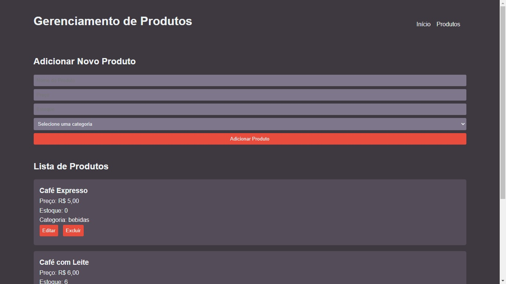
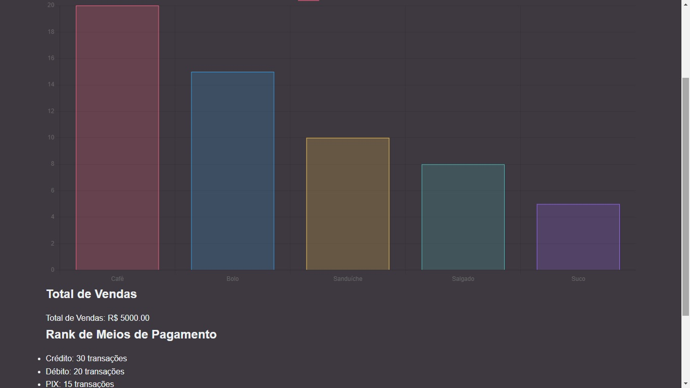

# pdv-cafeteria
PDV de cafeteria
Sistema PDV para Cafeteria
Um sistema simples de Ponto de Venda (PDV) desenvolvido em HTML, CSS e JavaScript para uma cafeteria, permitindo o cadastro de produtos, controle de estoque, carrinho de compras e processamento de pagamentos.

Funcionalidades
Cadastro de Produtos: Adicionar, editar e excluir produtos.
Carrinho de Compras: Adicionar produtos ao carrinho e realizar pedidos.
Processamento de Pagamentos: Escolha entre diferentes métodos de pagamento (crédito, débito, PIX ou dinheiro) com cálculo de troco.
Dashboard: Exibe gráficos com informações sobre vendas, produtos mais vendidos e rank de métodos de pagamento.
Tecnologias Utilizadas
Frontend: HTML, CSS (com alguns estilos básicos customizados) e JavaScript.
Backend Simulado: Utilização de dados simulados para operações de CRUD (Create, Read, Update, Delete) de produtos e para obtenção de estatísticas.
Contribuições
Contribuições são bem-vindas! Se você deseja melhorar este sistema, sinta-se à vontade para fazer um fork do projeto e enviar um pull request com suas alterações.

